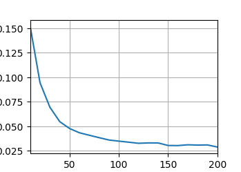
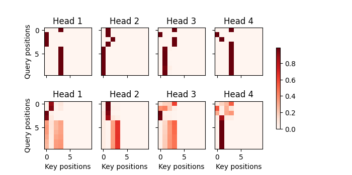

# Transformer
This project is designed to explore the attention mechanism and how to build an transformer model. The transformer model consists of encoder and decoder block, multi-attention ,self-attention, position-coding is included as well. By collecting the Eng-France dataset online, and through training, I completed a model can be used in text translation.
关键在项目问题以及解决方案，个人经历和贡献，理解和思考
## 一.介绍
### 1.项目背景
- 本项目基于 PyTorch 框架，旨在构建一个高效的机器翻译模型。我们使用了 Transformer 模型对英语-法语文本数据集进行了训练，以实现从英文到法语的高质量翻译功能。在项目中，除了实现基础翻译功能外，还深入学习了 Transformer 模型的原理与实现，包括自注意力机制、位置编码、编码器-解码器结构等关键模块。
- 虽然当前项目主要聚焦于学习与实现，但我们也探索了部分模型优化策略，为未来的多语言翻译扩展奠定了基础。通过本项目，我不仅强化了对深度学习框架的理解，还掌握了如何将理论与实践结合，完成从数据预处理到模型训练与评估的全流程。未来，该项目可以进一步应用于多语言场景，或通过模型微调提升特定领域翻译质量。
### 2.技术栈
#### 编程语言：Python 3.10.16
#### 深度学习框架：PyTorch. torch Version: 2.5.1+cu121
#### 模型架构：Transformer。
#### 辅助工具：Matplotlib 3.7.2（可视化）,NumPy 1.24.3（数组运算）,Pandas 2.0.3（数据集读取）
#### 训练工具：GPU（CUDA 支持）。
#### 代码管理：Git、VS Code。
#### 评估与可视化：自定义的 Animator 类，show_heatmaps函数
详细记录背景和假设：确保对项目的背景、目标和假设做详细清晰的说明，帮助他人理解你的工作。
清晰描述方法和过程：对于方法论和实验步骤，要描述清晰，确保别人能够根据你的描述理解每一个关键的步骤，包括算法原理、数据处理流程、模型设计等。
提供充分的实验验证：如果项目包含实验，确保数据集、实验设置、评估指标等都描述明确，并且提供必要的结果支持，避免模糊不清的结果或解释。
使用清晰的语言和格式：避免过于复杂的语言和专业术语，尽量使用简洁明了的表达，使得描述可以被广泛理解。适当时可以配合图表、公式等辅助说明。
## 二.Transformer模型结构和原理
### 1.模型结构
- Transformer模型是基于注意力机制的深度学习模型，模型分成编码器和解码器两大模块，编码器模块由多个相同的层来组成，每个层都有两个子层。第一个子层是多头自注意力汇聚；第二个子层是基于位置的前馈网络。具体来说，在计算编码器的自注意力时，查询、键和值都来自前一个编码器层的输出。每个子层都采用了残差连接加法计算，然后再应用层规范化。

- Transformer解码器也是由多个相同的层叠加而成的，并且层中使用了残差连接和层规范化。解码器层由三个子层构成，第一个子层是掩蔽多头自注意力层，该层的输入全都依赖于解码器的上一层，查询，键，值都来自上一个解码器层的输出。解码器中的每个位置只能考虑该位置之前的所有位置。这种掩蔽（masked）注意力保留了自回归（auto-regressive）属性，确保预测仅依赖于已生成的输出词元。掩蔽注意力的实现与RNN中的隐状态实现有相似之处，都在模块的前向传播函数中引入了隐状态state。第二个层是编码器－解码器注意力（encoder-decoder attention）层。在编码器－解码器注意力中，查询来自前一个解码器层的输出，而键和值来自整个编码器的输出。最后一个子层是一个基于位置的逐位前馈网络。
  

### 2.模型原理
#### （1）自注意力机制(self-attention)
  自注意力机制是Transformer的关键技术，实现上可以看作是将多头注意力中的查询，键，值都设置成相同张量，它允许模型在处理一个输入序列的每个元素时，能够关注到该序列中所有其他元素的信息。在传统的RNN中，信息是按时间步骤依赖的，而自注意力机制则通过计算每个词之间的相关性（即注意力权重），让模型更有效地捕获全局依赖。同时通过位置编码，使得transformer模型能够关注到输入序列的位置信息
  
自注意力的计算过程：
假设有一个输入序列，我们需要为每个词xi​计算与序列中其他词的关系：
查询（Query）、键（Key）、值（Value）：
通过对输入序列进行线性变换得到三个向量：查询Query，键Key，值Value. Q,K,V 的维度通常相同
(query_size = key_size = query_size = num_hiddens)

num_hiddens一般表示隐藏层单元数量，在transformer中num_hiddens大小一般根据输入序列特征数确定

计算注意力权重：
计算的是每个查询与所有键的相似度。使用查询和键计算相似度，常用的是点积计算：

$$
\text{Attention}(Q, K, V) = \text{softmax}\left(\frac{QK^T}{\sqrt{d_k}}\right)V
$$

#### （2）多头注意力（Multi-Head Attention）
多头注意力机制通过多个“头”并行计算自注意力，每个头在不同的子空间上学习不同的注意力模式，最终将这些头的输出拼接起来。从而可以学习输入序列不同的语义信息，提高模型表现。每个头计算注意力权重一般也是采用点积注意力

#### （3）位置编码（Positional Encoding）
由于transformer不像RNN,CNN具有顺序处理能力，因此引入了位置编码，位置编码是一个与输入序列长度相同的向量，它加入到输入嵌入（embedding）中，可以帮助模型捕捉词语在序列中的位置。本项目中通过正弦余弦函数生成位置编码，从而注入绝对或是相对位置
## 三.技术细节
### （）包导入
```python
import random
import torch
from d2l import torch as d2l
import re 
import matplotlib.pyplot as plt
from sequence.text_processing import Vocab 
import pandas as pd
import math
import os
os.environ["KMP_DUPLICATE_LIB_OK"] = 'TRUE'
```
描述模块的设计动机、理论支撑和高层逻辑。
示例：多头注意力机制为什么能够提升模型效果？
### （）训练数据集预处理
#### <>文本加载
#### <>分词
#### <>vocab模块
#### <>随机分区
#### <>顺序分区
### （）多头注意力机制
### （）自注意力机制
### （）位置编码
### （）前馈网络
### （）层规范化
### （）编码器结构
### （）解码器结构
### （）编码器解码器耦合
### （）训练流程
## 四.关键代码段实现
展示具体实现方式和工具的使用。
示例：torch.nn.MultiheadAttention 的实现如何调用？
### （）训练数据集预处理
使用d2l库中封装好的函数d2l.load_data_nmt，内部实现主要包括链接到d2l数据中心DATA_HUB[]，返回所需文档的url,如果查询本地不存在该文件，利用流式传输下载到本地，然后进行解压，读取，预处理，包括替换文本中的非破坏性空格（'\u02f'和'\xa0'）,将所有字母替换为小写以及在前面没有空格的标点符号前插入空格，然后对文本进行分词，词元索引转化，利用torch.utils.data.DataLoade构建数据迭代器

以下是实现的关键代码
#### <>分词tokenize
```python
def tokenize(lines,token='word'):
    if token=='word':
        return [line.split() for line in lines]
    elif token=='char':
        return [list(line) for line in lines]
    else:
        print('错误，未知词元类型:'+token)
```
#### <>vocab模块
```python
#将词元列表tokens转变为idx_to_token(初始索引-词元列表)，然后进一步转变为token_to_idx(词元-索引表)
#利用collections.Counter(tokens)来得到_token_freqs列表，按照词频进行排序，降序排列
class Vocab:
    #__xxx__特殊方法在使用实例化对象时会自动调用
    def __init__(self,tokens=None,min_freq=0,reserved_token=None):
        if tokens is None:
            tokens=[]
        if reserved_token is None:
            reserved_token=[]
        #按照token的出现频率(key = lambda x:x[1])进行排序,降序排列(reverse=True)
        counter = count_corpus(tokens)
        self._token_freq=sorted(counter.items(),key=lambda x : x[1] ,reverse=True)
        #然后对idx_to_token列表（按索引顺序存储词元，以便将索引映射回具体词元）以及token_to_idx字典（按词元即键值，快速查找对应的索引)
        #以此进行初始化，优先在idx_to_token中加入特殊token(reserved_token),比如<unk>表示词表中的未知词元，<pad>对序列进行填充，<bos><eos>序列的起始和结束标记
        self.idx_to_token = ['<unk>']+reserved_token
        #用idx_to_token来初始化token_to_idx,注意要用self.，表示是Vocab的实例的属性，便于之后进行访问与修改，保证了代码的封装性
        self.token_to_idx = {token:idx for idx,token in enumerate(self.idx_to_token)}
        #利用词频表更新idx_to_token,从而更新token_to_idx
        for token,freq in self._token_freq:
            if freq<min_freq:
                break
            if token not in self.token_to_idx:
                self.idx_to_token.append(token)
                self.token_to_idx[token]=len(self.idx_to_token)-1
    def __len__(self):
        return len(self.idx_to_token)
    #单个词元就直接用get获取该token对应的索引值，列表或者元组就对tokens中的每个token进行递归调用
    def __getitem__(self,tokens):
        if not isinstance(tokens,(list,tuple)):
            #get是python内置的通过字典的键来获取值(即索引)的方法
            return self.token_to_idx.get(tokens,self.unk )
        return [self.__getitem__(token) for token in tokens]
    #将索引(indices)转换成对应的词元(token),为列表或者tuple也只要用self.idx_to_token(index)直接获取
    def __totokens__(self,indices):
        if not isinstance(indices,(list,tuple)):
            return self.idx_to_token[indices]
        return [self.idx_to_token(index)for index in indices]
    @property
    def unk(self):
        return 0
    @property
    def token_freq(self):
        return self._token_freq
```
#### <>随机分区
```

```
#### <>顺序分区
```python

```
### （）多头注意力机制
```python

```
### （）自注意力机制
```python

```
### （）位置编码
```python

```
### （）前馈网络
```python

```
### （）层规范化
```python

```
### （）编码器结构
```python

```
### （）解码器结构
```python

```
### （）编码器解码器耦合
```python

```
### （）训练流程
```python

```
## 五.实验与结果分析 (Experiments and Results)
### 1.损失曲线

### 2.注意力权重热力图
- 编码器自注意力权重



- 解码器自注意力权重
  


- 编码器解码器注意力权重
  

### 3.测试结果展示(bleu)

loss 0.029, 5164.5 tokens/sec on cuda:0
| original sentence => target sentence       | bleu       | 
|------------|------------|
|go .=>va ! |  bleu 1.000|
|i lost .=>j'ai perdu .|  bleu 1.000|
|he's calm .=>il est calme .|  bleu 1.000|
|I'm home .=>je suis chez moi .|  bleu 1.000|

实验设计：简要描述你如何设计实验，包括数据集的选择、训练和评估方法。
结果展示：展示模型的训练过程、评估指标（如准确率、F1 分数、损失函数等），并通过图表展示模型的表现。如果有与其他模型的比较，可以展示对比结果。
模型优化：说明你如何优化模型，比如调整超参数、增加正则化、改变网络结构等，来提高性能。
## 六.技术挑战以及个人思考
### .分词以及词元索引转化
### .训练过程中张量数据的格式转换
### .参数列表匹配
### .动态模块化
### .模块化设计，封装技术细节

