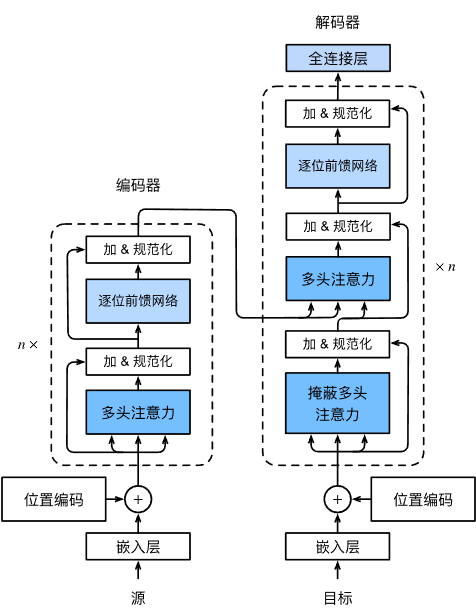
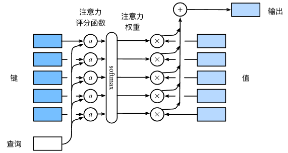
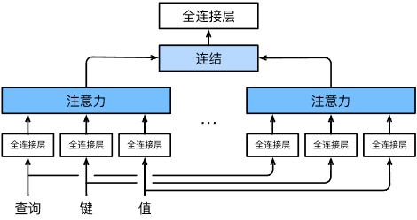
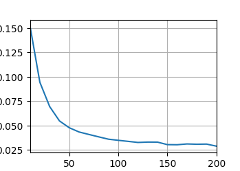
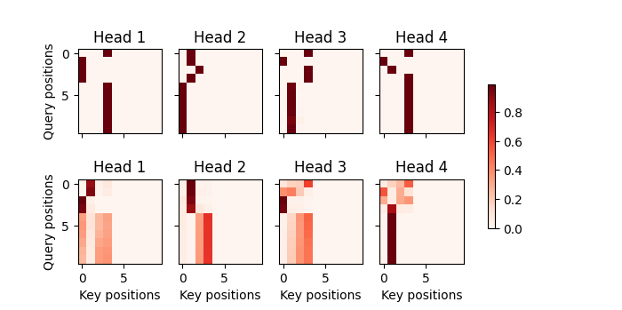
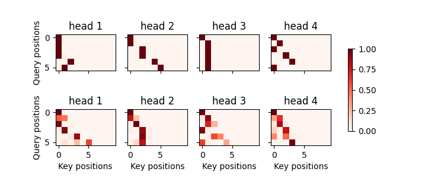
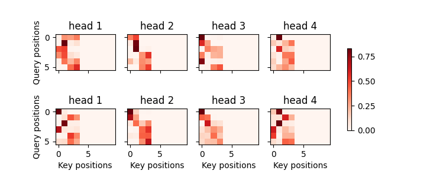

# Transformer
This project is designed to explore the attention mechanism and how to build an transformer model. The transformer model consists of encoder and decoder block, multi-attention ,self-attention, position-coding is included as well. By collecting the Eng-France dataset online, and through training, I completed a model can be used in text translation.
## Chapter 1 Introduction
### 1.Project Background
- This project is based on the PyTorch framework and aims to build an efficient machine translation model. We used the Transformer model to train on an English-French text dataset to achieve high-quality translation from English to French. In this project, in addition to implementing the basic translation functionality, we also delved into the principles and implementation of the Transformer model, including key modules such as the self-attention mechanism, positional encoding, and the encoder-decoder structure.
- Through this project, you can strengthen your understanding of the deep learning framework Transformer and learned how to integrate theory with practice, completing the entire process from data preprocessing to model training and evaluation. In the future, this project can be further applied to multilingual scenarios or improved through model fine-tuning to enhance translation quality in specific domains.
### 2.Technology Stack
#### Programming Language：Python 3.10.16
#### Deep Learning Framework：PyTorch. torch Version: 2.5.1+cu121
#### Model Architecture：Transformer。
#### Auxiliary Tools：Matplotlib 3.7.2（Visualization）,NumPy 1.24.3（Array Operation）,Pandas 2.0.3（Dataset Reading）
#### Training Tools：GPU（CUDA Support）。
#### Code Management：Git、VS Code。
#### Evaluation and Visualization：Custom Animator Class，show_heatmap Function
## Chapter 2.Transformer Model Architecture and Principles
### 1.Model Architecture
- The Transformer model is a deep learning architecture based on the attention mechanism, divided into two main modules: the encoder and the decoder. The encoder module consists of multiple identical layers, with each layer containing two sub-layers. The first sub-layer is multi-head self-attention aggregation, and the second sub-layer is a position-wise feed-forward network. Specifically, when calculating the self-attention in the encoder, the queries, keys, and values all come from the output of the previous encoder layer. Each sub-layer uses residual connections followed by layer normalization.
- The Transformer decoder is also composed of multiple identical layers stacked together, and residual connections and layer normalization are used in each layer. The decoder layer consists of three sub-layers. The first sub-layer is a masked multi-head self-attention layer, where all inputs depend on the output of the previous decoder layer. Queries, keys, and values all come from the output of the previous decoder layer. In the decoder, each position can only attend to all positions before it. This masking attention retains the auto-regressive property, ensuring that predictions depend only on the previously generated output tokens. The implementation of masked attention is similar to the hidden state implementation in RNNs, where a hidden state is introduced in the forward pass of the module. The second sub-layer is the encoder-decoder attention layer. In encoder-decoder attention, the queries come from the output of the previous decoder layer, while the keys and values come from the entire output of the encoder. The final sub-layer is a position-wise feed-forward network.
  

### 2.Model Principle
#### （1）self-attention Mechanism
  The self-attention mechanism is a key technology in the Transformer model. In terms of implementation, it can be seen as setting the queries, keys, and values in multi-head attention to the same tensor. It allows the model to focus on information from all other elements in the sequence when processing each element of the input sequence. In traditional RNNs, information is dependent on time steps, while self-attention calculates the relevance (i.e., attention weights) between each word, enabling the model to more effectively capture global dependencies. Additionally, position encoding allows the Transformer model to pay attention to the positional information of the input sequence.
  
The computation process of self-attention: Assume there is an input sequence, and we need to calculate the relationship between each word xi and other words in the sequence.
Query、Key、Value：
By performing a linear transformation on the input sequence, three vectors are obtained: Query, Key, and Value. The dimensions of Q, K, and V are usually the same (query_size = key_size = value_size = num_hiddens).

num_hiddens generally represents the number of hidden units, and in the Transformer model, the size of num_hiddens is typically determined based on the features of the input sequence.

Calculating Attention Weights: The attention weights are computed based on the similarity between each query and all keys. The similarity between the query and the key is commonly calculated using dot product：

$$
\text{Attention}(Q, K, V) = \text{softmax}\left(\frac{QK^T}{\sqrt{d_k}}\right)V
$$

#### （2）Multi-Head Attention
The multi-head attention mechanism calculates self-attention in parallel across multiple "heads." Each head learns different attention patterns in different subspaces, and the outputs of these heads are concatenated together. This allows the model to capture different semantic information from the input sequence, improving model performance. The attention weights for each head are generally computed using dot-product attention.

$$
\text{MultiHead}(Q, K, V) = \text{Concat}(\text{head}_1, \dots, \text{head}_h)W^O
$$

$$
\text{head}_i = \text{Attention}(QW_i^Q, KW_i^K, VW_i^V)
$$




#### （3）Positional Encoding
Since transformers, unlike RNNs and CNNs, do not have inherent sequential processing capabilities, positional encoding is introduced. Positional encoding is a vector that has the same length as the input sequence and is added to the input embeddings. It helps the model capture the position of words in the sequence. In this project, positional encoding is generated using sine and cosine functions, thereby injecting absolute or relative positions.
## Chapter 3.Technical Details
### （1）Package Import
```python
import random
import torch
from d2l import torch as d2l
import re 
import matplotlib.pyplot as plt
from sequence.text_processing import Vocab 
import pandas as pd
import math
import os
os.environ["KMP_DUPLICATE_LIB_OK"] = 'TRUE'
```

### （2）训练数据集预处理
The training dataset loading and preprocessing is a critical foundation for the model's data. In the internal implementation of d2l.load_data_nmt() in the d2l library, it includes connecting to the d2l data center (DATAHUB) to retrieve the URL corresponding to the 'fra-eng' training document, checking whether the related files exist locally. If not, it sends an HTTP request using the URL through request and responds by downloading the dataset to the local machine. The dataset is then loaded using with open.

Next, the text is preprocessed, which includes operations such as adding spaces before non-empty punctuation marks, converting letters to lowercase, and replacing non-breaking spaces with regular spaces for text normalization. After that, the text sequences are tokenized. Then, using the Vocab module, token-to-index and index-to-token mappings are built, which is a key operation for normalizing the text dataset before feeding it into the model.

Afterward, sequential partitioning can be applied to preserve the contextual dependencies, or random partitioning can be used to enhance the model's generalization ability. Finally, using PyTorch's utils module, torch.utils.data.DataLoader is employed to create iterators. For specific implementation details, you can refer to the corresponding source code in the d2l library. Below is a part of the operations for reading and normalizing the data.

```python
def read_data_nmt():
    """Load the English-French dataset.

    Defined in :numref:`sec_utils`"""
    data_dir = d2l.download_extract('fra-eng')
    with open(os.path.join(data_dir, 'fra.txt'), 'r', encoding='utf-8') as f:
        return f.read()

def preprocess_nmt(text):
    """Preprocess the English-French dataset.

    Defined in :numref:`sec_utils`"""
    def no_space(char, prev_char):
        return char in set(',.!?') and prev_char != ' '

    # Replace non-breaking space with space, and convert uppercase letters to
    # lowercase ones
    text = text.replace('\u202f', ' ').replace('\xa0', ' ').lower()
    # Insert space between words and punctuation marks
    out = [' ' + char if i > 0 and no_space(char, text[i - 1]) else char
           for i, char in enumerate(text)]
    return ''.join(out)
```
#### <1> Tokenize
Tokenization is a key operation in NLP tasks, with the following advantages:
- By breaking down long sequence strings into multiple independent tokens, it improves the processing efficiency for computers.
- By treating words as the basic unit for text analysis, it allows the model to capture the semantics and contextual relationships between words.
- Most models require discrete inputs, and tokenization can adapt to the input format of the model, providing a foundation for subsequent word vector encoding (via the Vocab module).
- It is a critical core module for tasks such as machine translation, sentiment analysis, search engines, and text generation.
#### <2> Vocab
In essence, it is the vocabulary management module, used for vocabulary mapping and index management. It is a key part of NLP technology, transforming tokens into index values that computers can process, with several core functions:
- Maintains a token frequency table, self._token_freq, implemented using the collections.Counter() module from Python's collections library. This token frequency table allows for the counting of tokens, sorting based on frequency, and facilitates the generation of an ordered token index table.
- Initializes the idx_to_token list (which stores tokens in order of index, allowing for easy mapping from index to specific token) and the token_to_idx dictionary (which allows for quick lookup of index corresponding to each token) using the token frequency table (self._token_freq). Through these two lists and dictionaries, the internal transformation between token indices and actual tokens can be automatically handled.
#### <3> Random Partition
Random partition is suitable for scenarios with large datasets and weak context dependencies, such as model pretraining and large-scale distributed training.
#### <4> Sequential Partition
Sequential partition is suitable for scenarios with strong context dependencies and task-specific needs, such as language translation and time series prediction. Both partitioning methods aim to divide the input data and training data into multiple partitions.
#### <5> Iterator Loading
After tokenization and index conversion, the dataset is read line by line. The first element of each line corresponds to the English source word, and the second element is the French target word. These elements are stored in separate arrays and then tensorized. Finally, the source token tensor array (src_array) and the target token tensor (tgt_array) are returned, along with their respective valid lengths (valid_lens). These tensors, along with the valid lengths, are combined into a four-dimensional tensor (src_array, src_valid_lens, tgt_array, tgt_valid_lens). Using the torch.utils.data.DataLoader module, an iterator is created from this tensor. Finally, the iterator (data_iter), source vocabulary (src_vocab), and target vocabulary (tgt_vocab) are returned in the text loading and preprocessing module.
### （3）Multi-Head Attention Mechanism
Through the multi-head attention mechanism, different heads can focus on diverse text features, such as:
- Capturing short-range dependencies in the text sequence, such as the relationship between adjectives and nouns.
- Capturing long-range dependencies in the text sequence, such as the relationship between the subject and predicate when there is a complex modifier.
- Helping the model understand semantic information, where some heads may focus on specific syntactic and semantic patterns.
It also enhances the robustness of the model. When the attention distribution of some heads becomes problematic, other heads can complement or adjust it. The sub-projection matrices in the hidden space also help the model learn complex, high-dimensional representations.
### （4）Self-Attention Mechanism
The self-attention mechanism assigns weights to each element to capture global dependencies between elements:
- Self-attention simultaneously uses the input sequence, after certain transformations, as the query, key, and value for calculating attention weights. During training, it dynamically adjusts the attention weights of each element in relation to itself and other elements in the sequence. In this English-to-French translation project, it captures the dependencies between different components of the sentence.
- It eliminates local position constraints. Unlike RNNs and CNNs, which can only process data sequentially and where the current data can only perceive previous historical data, self-attention treats all elements in the sequence equally. It can simultaneously focus on elements at different positions in the sequence, capturing long-distance dependencies. With the help of position encoding, it does not lose position information.
- The self-attention mechanism adjusts the weights dynamically based on the similarity between each element and other elements in the sequence. Through softmax normalization, it focuses on more relevant information based on the contextual semantics of the input, improving the reliability of decision-making.
### （5）Position Encoding
- Position encoding addresses the issue that the self-attention mechanism cannot capture position information. While allowing self-attention to capture global dependencies, it can also provide either relative or absolute position information. This enables the model to learn the order of elements in the sequence based on position information. Currently, sine and cosine functions are commonly used for position encoding.
- Absolute position encoding provides the specific position of elements, while relative position encoding focuses on the relative relationships between elements.
### （6）Feed-Forward Networks
Feed-forward networks are typically placed after the self-attention layers and can perform nonlinear transformations on each element in the sequence through parallel computation. This enhances the ability to transform local information and capture more complex semantic features, thus obtaining deeper information. It has several advantages:
- Essentially, a feed-forward network consists of two fully connected layers with a nonlinear activation function in between, commonly ReLU. It transforms the input sequence into an output sequence through nonlinear transformations, enabling the model to capture complex patterns in the input data. This allows the model to solve not only simple linear problems but also complex ones.
- Parallel computation greatly increases the model's computational speed, offering higher computational efficiency.
### （7）Layer Normalization
Layer normalization normalizes the data for each layer, improving the stability of the model training process, accelerating convergence, and enhancing model performance:
- Layer normalization normalizes the input for each layer, stabilizing the mean and variance to avoid gradient explosion and vanishing gradients, which improves the stability of the model training process. By normalizing the activation values of each layer, it mitigates the issue of excessively large or small activation values caused by continuous parameter updates.
- Layer normalization makes the input distribution of each layer more stable, leading to smoother parameter updates in the neural network. This reduces fluctuations in parameter adjustments during training, allowing the model to achieve better performance in a shorter time. It also enables setting a larger learning rate, accelerating the convergence speed, without worrying about excessive parameter changes or gradient explosion issues.
- By normalizing the activation values of each layer, layer normalization reduces the differences between training samples, enabling the model to adapt to different inputs and accelerate convergence.
### （8）Encoder Structure
The encoder consists externally of an embedding layer and a position encoding module. Internally, it is made up of num_layers identical layers, each of which includes a self-attention sub-layer and a position-based feedforward network sub-layer. The sub-layers are connected through residual networks and layer normalization.
### （9）Decoder Structure
The decoder consists externally of an embedding layer and a position encoding module. Internally, it is made up of num_layers identical layers. Each layer includes a masked self-attention sub-layer and a feedforward network sub-layer, with an additional encoder-decoder attention sub-layer placed between them. The sub-layers are connected through residual networks and layer normalization. Finally, a fully connected layer nn.Linear(num_hiddens, tgt_vocab) outputs the predicted sequence, mapping from the source sequence to the predicted sequence.
### （10）Encoder-Decoder Coupling
The d2l library provides the d2l.EncoderDecoder() module, which initializes both the Encoder and Decoder modules in the initialization function. During the forward pass, the propagation follows the flow: encoder -> decoder.init_state -> decoder, constructing the transformer model
### （11）Training Process
The sequence-to-sequence training process can be divided into the following steps:
- Xavier initialization of model weights.
- Initialization of model components, including the optimizer (using torch.Adam()) and the loss function (using MaskedSoftmaxLoss).）
- Setting the model to training mode with net.train() and defining an animator (to track the accumulated loss during training and plot the loss curve).
- Iterative training: In each iteration, a timer(d2l.Timer) is used to track the training time, and a metric(d2l.Accumulator(2)) is used to calculate the total loss and token count during each iteration.
- Constructing a tensor consisting of the target sequence (Y) with a batch size of Y.shape[0], filled with <bos> (beginning-of-sequence token), as the initial input for the decoder, and then constructing the decoder input.
- Performing forward propagation and loss calculation (comparing the predicted values from forward propagation with the true labels).
- Calculating the loss, performing backpropagation to ensure the loss is a scalar, clipping the gradients, and updating model parameters. Loss accumulation and token accumulation are done without updating gradients.
- Finally, updating the animator every ten epochs to plot the loss graph.
## 四.关键代码段实现
### （1）训练数据集预处理
使用d2l库中封装好的函数d2l.load_data_nmt，内部实现主要包括链接到d2l数据中心DATA_HUB[]，返回所需文档的url,如果查询本地不存在该文件，利用流式传输下载到本地，然后进行解压，读取，预处理，包括替换文本中的非破坏性空格（'\u02f'和'\xa0'）,将所有字母替换为小写以及在前面没有空格的标点符号前插入空格，然后对文本进行分词，词元索引转化，利用torch.utils.data.DataLoade构建数据迭代器
```python
train_iter, src_vocab, tgt_vocab = d2l.load_data_nmt(batch_size,num_steps)
```
以下是内部实现的关键代码
#### <1>分词tokenize
```python
def tokenize(lines,token='word'):
    if token=='word':
        return [line.split() for line in lines]
    elif token=='char':
        return [list(line) for line in lines]
    else:
        print('错误，未知词元类型:'+token)
```
#### <2>vocab模块
```python
#将词元列表tokens转变为idx_to_token(初始索引-词元列表)，然后进一步转变为token_to_idx(词元-索引表)
#利用collections.Counter(tokens)来得到_token_freqs列表，按照词频进行排序，降序排列
class Vocab:
    #__xxx__特殊方法在使用实例化对象时会自动调用
    def __init__(self,tokens=None,min_freq=0,reserved_token=None):
        if tokens is None:
            tokens=[]
        if reserved_token is None:
            reserved_token=[]
        #按照token的出现频率(key = lambda x:x[1])进行排序,降序排列(reverse=True)
        counter = count_corpus(tokens)
        self._token_freq=sorted(counter.items(),key=lambda x : x[1] ,reverse=True)
        #然后对idx_to_token列表（按索引顺序存储词元，以便将索引映射回具体词元）以及token_to_idx字典（按词元即键值，快速查找对应的索引)
        #以此进行初始化，优先在idx_to_token中加入特殊token(reserved_token),比如<unk>表示词表中的未知词元，<pad>对序列进行填充，<bos><eos>序列的起始和结束标记
        self.idx_to_token = ['<unk>']+reserved_token
        #用idx_to_token来初始化token_to_idx,注意要用self.，表示是Vocab的实例的属性，便于之后进行访问与修改，保证了代码的封装性
        self.token_to_idx = {token:idx for idx,token in enumerate(self.idx_to_token)}
        #利用词频表更新idx_to_token,从而更新token_to_idx
        for token,freq in self._token_freq:
            if freq<min_freq:
                break
            if token not in self.token_to_idx:
                self.idx_to_token.append(token)
                self.token_to_idx[token]=len(self.idx_to_token)-1
    def __len__(self):
        return len(self.idx_to_token)
    #单个词元就直接用get获取该token对应的索引值，列表或者元组就对tokens中的每个token进行递归调用
    def __getitem__(self,tokens):
        if not isinstance(tokens,(list,tuple)):
            #get是python内置的通过字典的键来获取值(即索引)的方法
            return self.token_to_idx.get(tokens,self.unk )
        return [self.__getitem__(token) for token in tokens]
    #将索引(indices)转换成对应的词元(token),为列表或者tuple也只要用self.idx_to_token(index)直接获取
    def __totokens__(self,indices):
        if not isinstance(indices,(list,tuple)):
            return self.idx_to_token[indices]
        return [self.idx_to_token(index)for index in indices]
    @property
    def unk(self):
        return 0
    @property
    def token_freq(self):
        return self._token_freq

#通过count_corpus()返回的是词元词频统计列表
def count_corpus(tokens):
    #如果tokens列表为空或tokens列表第一个元素是list,即tokens是二维列表，此时需要进行列表展开操作
    if len(tokens)==0 or isinstance(tokens[0],list):
        #tokens-line-token
        tokens = [token for line in tokens for token in line]
    return collections.Counter(tokens)

```
#### <3>随机分区
```python
def seq_data_iter_random(corpus, batch_size, num_steps):  #@save
    #"""使用随机抽样生成一个小批量子序列"""
    # 从随机偏移量开始对序列进行分区，随机范围包括num_steps-1
    corpus = corpus[random.randint(0, num_steps - 1):]
    # 减去1，是因为我们需要考虑标签
    num_subseqs = (len(corpus) - 1) // num_steps
    # 长度为num_steps的子序列的起始索引
    initial_indices = list(range(0, num_subseqs * num_steps, num_steps))
    # 在随机抽样的迭代过程中，
    # 来自两个相邻的、随机的、小批量中的子序列不一定在原始序列上相邻
    random.shuffle(initial_indices)

    def data(pos):
        # 返回从pos位置开始的长度为num_steps的序列
        return corpus[pos: pos + num_steps]

    num_batches = num_subseqs // batch_size
    for i in range(0, batch_size * num_batches, batch_size):
        # 在这里，initial_indices包含子序列的随机起始索引
        initial_indices_per_batch = initial_indices[i: i + batch_size]
        X = [data(j) for j in initial_indices_per_batch]
        Y = [data(j + 1) for j in initial_indices_per_batch]
        yield torch.tensor(X), torch.tensor(Y)
```
#### <4>顺序分区
```python
def seq_data_iter_sequential(corpus, batch_size, num_steps):  #@save
    #"""使用顺序分区生成一个小批量子序列"""
    # 从随机偏移量开始划分序列
    offset = random.randint(0, num_steps)
    num_tokens = ((len(corpus) - offset - 1) // batch_size) * batch_size
    Xs = torch.tensor(corpus[offset: offset + num_tokens])
    Ys = torch.tensor(corpus[offset + 1: offset + 1 + num_tokens])
    Xs, Ys = Xs.reshape(batch_size, -1), Ys.reshape(batch_size, -1)
    num_batches = Xs.shape[1] // num_steps
    for i in range(0, num_steps * num_batches, num_steps):
        X = Xs[:, i: i + num_steps]
        Y = Ys[:, i: i + num_steps]
        yield X, Y
```
#### <5>迭代器加载
```python
def load_array(data_arrays, batch_size, is_train=True):
    """Construct a PyTorch data iterator.

    Defined in :numref:`sec_utils`"""
    dataset = torch.utils.data.TensorDataset(*data_arrays)
    return torch.utils.data.DataLoader(dataset, batch_size, shuffle=is_train)
```
### （2）注意力函数
计算点积注意力以及加性注意力需要提前定义好掩蔽softmax操作，用于将超过有效长度的元素用一个非常大的负值代替，避免影响后续计算，同时处理好有效长度valid_lens的转化
```python
def masked_softmax(X,valid_lens):
    if valid_lens is None:
        return nn.functional.softmax(X,dim=-1)
    else:
        shape = X.shape
        #进行valid_lens维度变换，本质上是为了与输入张量X进行维度匹配
        if valid_lens.dim() == 1:
            #当valid_lens是一维时，将其广播为二维，第二维的长度与X的第二维相匹配,比如[2,3]，假设shape[1]=2，每个样本有两个序列，对应每个序列[2,2,3,3]
            valid_lens = torch.repeat_interleave(valid_lens,shape[1])
        else:
            #当valid_lens是二维时，为了避免维度不匹配，将其展开为一维，方便与输入张量X的维度相匹配
            valid_lens = valid_lens.reshape(-1)
    #X展平为(batch_size * seq_len, feature_size)形状,可以堪称批次数量（样本数）,序列数,每个序列的特征值数量
    X = d2l.sequence_mask(X.reshape(-1,shape[-1]),valid_lens,value=-1e6)
    return nn.functional.softmax(X.reshape(shape),dim=-1)
```
####  <1>点积注意力
这是多头注意力和自注意力的基础，常用于计算注意力权重
```python
#缩放点积注意力,计算效率高，适合在GPU上进行计算，广泛应用于transformer模型中
#DotProductAttention,dropout,queries,keys,values,valid_lens,d,scores,attention_weights
class DotProductAttention(nn.Module):
    def __init__(self, dropout, **kwargs):
        super(DotProductAttention,self).__init__(**kwargs)
        self.dropout=nn.Dropout(dropout)
    #valid_lens初始值设置为None
    def forward(self,queries,keys,values,valid_lens=None):
        #利用queries以及keys的特征数d(shape[-1])进行缩放
        d = queries.shape[-1]
        #在缩放点积注意力中，要求queries和keys的特征数相同,对应scores形状为(batch_size,query_size,kv_pair_size)
        scores =torch.bmm(queries,keys.transpose(1,2))/math.sqrt(d)
        self.attention_weights = masked_softmax(scores,valid_lens)
        return torch.bmm(self.dropout(self.attention_weights),values)
```
#### <2>加性注意力
```python
class AddictiveAttention(nn.Module):
    #super()传入当前类名，表示向上查询当前类的直接父类，self表示传递当前类的直接实例
    def __init__(self, key_size,query_size,num_hiddens,dropout,**kwargs):
        super(AddictiveAttention,self).__init__(**kwargs)
        self.W_q = nn.Linear(query_size,num_hiddens,bias=False)
        self.W_k = nn.Linear(key_size,num_hiddens,bias=False)
        self.W_v = nn.Linear(num_hiddens,1,bias=False)
        self.dropout = nn.Dropout(dropout)
    def forward(self,queries,keys,values,valid_lens):
        #对应的queries最后形状为(batch_size,query_size,(1),num_hiddens),keys形状为(batch_size,(1),kv_pair_size,num_hiddens),在features计算中
        #为了便于广播，需要调整维度,最后得到的features形状为(batch_size,query_size,kv_pair_size,num_hiddens),注意key_size与value_size相同，pairsize
        queries,keys = self.W_q(queries),self.W_k(keys)
        features = queries.unsqueeze(2)+keys.unsqueeze(1)
        features = torch.tanh(features)
        #scores删除了最后一维num_hiddens,因此形状为(batch_size,query_size,kv_pair_size)
        scores = self.W_v(features).squeeze(-1)
        self.attention_weights = masked_softmax(scores,valid_lens)
        #values形状为(batch_size,kv_pair_size,value_size),因此应用权重矩阵后为(batch_size,query_size,value_size)
        #输出矩阵的每一行可以视为一个查询的上下文表示
        return torch.bmm(self.dropout(self.attention_weights),values)
```
### （3）多头注意力
```python
#进行多头注意力模型建模
#MultiHeadAttention,key_size,query_size,value_size,num_hiddens,num_heads,dropout,bias,attention,W_q,W_k,W_v,W,_o
class MultiHeadAttention(nn.Module):
    def __init__(self,key_size, query_size, value_size, num_hiddens, num_heads, dropout, bias = False,  **kwargs):
        super(MultiHeadAttention,self).__init__(**kwargs)
        self.num_heads = num_heads
        self.attention = d2l.DotProductAttention(dropout)
        self.W_q = nn.Linear(query_size,num_hiddens,bias = bias)
        self.W_k = nn.Linear(key_size,num_hiddens,bias = bias)
        self.W_v = nn.Linear(value_size,num_hiddens,bias = bias)
        self.W_o = nn.Linear(num_hiddens,num_hiddens,bias = bias)
    def forward(self,queries,keys,values,valid_lens):
        queries = transpose_qkv(self.W_q(queries),self.num_heads)
        keys = transpose_qkv(self.W_k(keys),self.num_heads)
        values = transpose_qkv(self.W_v(values),self.num_heads)
        if valid_lens is not None:
            valid_lens = torch.repeat_interleave(valid_lens,repeats=self.num_heads,dim=0)
        output = self.attention(queries,keys,values,valid_lens)
        output_concat = transpose_output(output,self.num_heads)
        return self.W_o(output_concat)

#为了多注意力的头进行矩阵形状转换
#从输入X(batch_size,kv_pair_size,num_hiddens)->(batch_size,kv_pair_size,num_heads,num_hiddens/num_heads)
#->(batch_size,num_heads,kv_pair_size,num_hiddens/num_heads)->(batch_size*num_heads,kv_pair_size,num_hiddens/num_heads)
def transpose_qkv(X,num_heads):
    X = X.reshape(X.shape[0],X.shape[1],num_heads,-1)
    X = X.permute(0,2,1,3)
    return X.reshape(-1,X.shape[2],X.shape[3])
#恢复成原来的形状
def transpose_output(X,num_heads):
    X = X.reshape(-1,num_heads,X.shape[1],X.shape[2])
    X = X.permute(0,2,1,3)
    return X.reshape(X.shape[0],X.shape[1],-1)
```
### （4）自注意力
```python
#自注意力机制本质上就是输入数据同时作为query,key,value，通过多头注意力模型寻找输入数据之间的相关性
num_hiddens, num_heads = 100, 5
attention = MultiHeadAttention(num_hiddens,num_hiddens,num_hiddens,num_hiddens,num_heads,0.5)
attention.eval()
#batch_size,num_queries,num_kv_pairs,valid_lens,X,Y
batch_size, num_queries = 2, 4
valid_lens = torch.tensor([3,2])
X = torch.ones((batch_size,num_queries,num_hiddens))
attention(X,X,X,valid_lens).shape
```
### （5）位置编码
```python
#位置编码，利用正弦以及余弦函数进行固定位置编码，分别针对偶数维度使用正弦函数，奇数维度使用余弦函数
#PositionalEncoding,self,num_hiddens,dropout,maxlen,P,X,dtype
class PositonalEncoding(nn.Module):
    #不需要引入**kwargs，因为函数的计算方法以及计算函数都是固定的，也不需要引入动态参数或不确定的参数
    def __init__(self, num_hiddens,dropout,max_len = 1000):
        super(PositonalEncoding,self).__init__()
        self.dropout = nn.Dropout(dropout)
        #torch.zeros()传入的是一个矩阵的形状
        self.P = torch.zeros((1,max_len,num_hiddens))
        #位置编码本质上就是将时间步或是序列位置的索引值(maxlen)映射到特征维度(num_hiddens)上
        #通过不同频率的正弦和余弦函数，赋予模型在序列位置处理中的位置感知能力，以下是计算公式代码
        X = torch.arange(max_len,dtype=torch.float32).reshape(-1,1)/torch.pow(10000,torch.arange(0,num_hiddens,2,dtype=torch.float32)/num_hiddens)
        #P的形状为(1,num_steps,num_hiddens)
        self.P[:,:,0::2] = torch.sin(X)
        self.P[:,:,1::2] = torch.cos(X)
    def forward(self,X):
        #通过:X.shape[1]将P的第二维与X的第二维即num_steps进行对齐，其他维度自动广播，然后将P放置在与X相同的设备上(GPU&CPU),否则无法进行计算
        X = X + self.P[:,:X.shape[1],:].to(X.device)
        return self.dropout(X)
```
### （6）前馈网络
```python
#建立基于位置的前馈网络，对输入的每个特征进行独立的映射，操作与位置无关，由两个全连接层以及一个激活层构成
#PositionWiseFFN,ffn_num_input,ffn_num_hiddens,ffn_num_outputs,dense1,relu,dense2
class PositionWiseFFN(nn.Module):
    def __init__(self, ffn_num_input, ffn_num_hiddens, ffn_num_outputs,**kwargs):
        super(PositionWiseFFN,self).__init__(**kwargs)
        self.dense1 = nn.Linear(ffn_num_input,ffn_num_hiddens)
        self.relu = nn.ReLU()
        self.dense2 = nn.Linear(ffn_num_hiddens, ffn_num_outputs)
    def forward(self, X):
        return self.dense2(self.relu(self.dense1(X)))
```
### （7）层规范化
```python
#传入前馈网络处理后的数据(需要进行随机丢神经元dropout)以及输入数据，进行残差连接后进行层规范化
#AddNorm,normalized_shape,dropout
class AddNorm(nn.Module):
    def __init__(self, normalized_shape, dropout, **kwargs):
        super(AddNorm,self).__init__(**kwargs)
        self.dropout = nn.Dropout(dropout)
        self.ln = nn.LayerNorm(normalized_shape)
    #使用Addnorm的前向传播时，传入上一层输入X以及当前层输出Y
    def forward(self, X, Y):
        return self.ln(self.dropout(Y)+X)
```
### （8）编码器结构
```python
#构建transformer编码器模块，attention-> addnorm1-> ffn-> addnorm2  ,use_bias用于控制是否在层的计算中使用偏置项
#EncoderBlock,key_size,query_size,value_size,num_hiddens,norm_shape,ffn_num_input,ffn_num_hiddens,num_heads,dropout,use_bias
#attention,addnorm1,ffn,addnorm2,X,valid_lens,Y
class EncoderBlock(nn.Module):
    def __init__(self, key_size, query_size, value_size, num_hiddens, norm_shape, ffn_num_input, ffn_num_hiddens, num_heads, dropout, use_bias = False, **kwargs):
        super(EncoderBlock,self).__init__(**kwargs)
        self.attention = d2l.MultiHeadAttention(num_hiddens,num_heads,dropout,use_bias)
        self.addnorm1 = AddNorm(norm_shape,dropout)
        self.ffn = PositionWiseFFN(ffn_num_input,ffn_num_hiddens,num_hiddens)
        self.addnorm2 = AddNorm(norm_shape,dropout)
    def forward(self,X,valid_lens):
        Y = self.addnorm1(X,self.attention(X, X, X, valid_lens))
        return self.addnorm2(Y,self.ffn(Y))

#构建transformer编码器，包括嵌入层->位置编码->num_layers个EncoderBlock模块
#相较于编码器模块，初始化参数多了vocab_size，用于将词表映射到隐藏层(特征维度)，num_layers，用于堆叠transformer模块
#TransformerEncoder,vocab_size,key_size,query_size,value_size,num_hiddens,norm_shape,ffn_num_input,ffn_num_hiddens,num_heads,num_layers,dropout,use_bias
#num_hiddens,embedding,pos_encoding,blks,'block'
class TransformerEncoder(d2l.Encoder):
    def __init__(self,vocab_size, key_size, query_size, value_size, 
                 num_hiddens, norm_shape, ffn_num_input, ffn_num_hiddens, 
                 num_heads, num_layers, dropout, use_bias = False,**kwargs):
        super(TransformerEncoder,self).__init__(**kwargs)
        self.num_hiddens = num_hiddens
        self.embedding = nn.Embedding(vocab_size, num_hiddens)
        self.pos_encoding = d2l.PositionalEncoding(num_hiddens,dropout)
        self.blks = nn.Sequential()
        for i in range(num_layers):
            self.blks.add_module("block"+str(i),EncoderBlock(key_size, query_size, value_size, num_hiddens,
                                                            norm_shape, ffn_num_input, ffn_num_hiddens, 
                                                            num_heads, dropout, use_bias))
    #X,attention_weights,blks,i,blk,
    def forward(self, X, valid_lens, *args):
        X = self.pos_encoding(self.embedding(X)*math.sqrt(self.num_hiddens))
        self.attention_weights = [None] * len(self.blks)
        #由于blks容器中存放的是(索引'block x'以及对应模型的键值对)，所以要想同时获得索引和模型，需要用enumerate进行遍历
        for i,blk in enumerate(self.blks):
            X = blk(X,valid_lens)
            #这个注意力权重的路径为blks->blk->d2l.MultiAttention->D2l.DotAttention->对应self.attention_weights
            self.attention_weights[i] = blk.attention.attention.attention_weights
        return X
```
### （9）解码器结构
```python
#构建解码器模块,注意训练阶段以及预推理阶段
#DecoderBlock,key_size,query_size,value_size,num_hiddens,norm_shape,ffn_num_input,ffn_num_hiddens, num_heads,dropout, i,**kwargs
#attention1, addnorm1, attrntion2, addnorm2, ffn, addnorm3
class DecoderBlock(nn.Module):
    def __init__(self, key_size, query_size, value_size, num_hiddens, norm_shape, ffn_num_input, ffn_num_hiddens, num_heads, dropout, i, **kwargs):
        super(DecoderBlock,self).__init__(**kwargs)
        self.i = i
        self.attention1 = d2l.MultiHeadAttention(num_hiddens, num_heads, dropout)
        self.addnorm1 = AddNorm(norm_shape, dropout)
        self.attention2 = d2l.MultiHeadAttention(num_hiddens, num_heads, dropout)
        self.addnorm2 = AddNorm(norm_shape, dropout)
        self.ffn = PositionWiseFFN(ffn_num_input, ffn_num_hiddens, num_hiddens)
        self.addnorm3 = AddNorm(norm_shape, dropout)
    #X, state, enc_outputs, enc_valid_lens, key_values, training, batch_size, num_steps, dec_valid_lens, X2, Y, Y2, Z
    def forward(self, X, state):#返回值包括规范化后的输出以及包含编码器输出，编码器有效长度以及解码器当前以及历史输入数据
        #利用保存当前解码器输入以及历史输出的隐状态state,来获取编码器输出(作为解码器输入)以及编码序列有效长度
        enc_outputs, enc_valid_lens = state[0], state[1]
        #state[2]实际上存放的是当前解码器输入块的历史输入信息，历史无数据，当前输入作为key_values,最后在传回state[2][self.i]
        if state[2][self.i] is None:
            key_values = X
        else:
            key_values = torch.cat((state[2][self.i],X), axis = 1)
        #注意key_values是包括解码器输入X以及历史数据，因此进行多头注意力训练时，可以视作自注意力机制
        state[2][self.i] = key_values
        #根据是否处于训练状态，训练时，需要根据输入X的形状(batch_size, num_steps, num_hiddens)对解码器有效长度
        if self.training:
            batch_size, num_steps, _ = X.shape
            dec_valid_lens = torch.arange(1, num_steps+1, device=X.device).repeat(batch_size, 1)
        else:
            dec_valid_lens = None
        #自注意力
        X2 = self.attention1(X, key_values, key_values, dec_valid_lens)
        Y = self.addnorm1(X, X2)
        #多头注意力,利用解码器输出(Y)以及编码器输入(enc_outputs)
        Y2 = self.attention2(Y, enc_outputs, enc_outputs, enc_valid_lens)
        Z = self.addnorm2(Y, Y2)
        return self.addnorm3(Z, self.ffn(Z)), state

#解码器构建，结构为嵌入层-> 位置编码-> num_layers层decoder_blk(blks)->全连接层
#TransformerDecoder, AttentionDecoder, vocab_size, query_size, value_size, num_hiddens, norm_shape, ffn_num_outputs,ffn_num_hiddens
#num_heads, num_layers, dropout, **kwargs, embedding, pos_encoding, blks
class TransformerDecoder(d2l.AttentionDecoder):
    #不需要引入偏置项bias
    def __init__(self,vocab_size, key_size, query_size, value_size, 
                 num_hiddens, norm_shape, ffn_num_input, ffn_num_hiddens, 
                 num_heads, num_layers, dropout, **kwargs):
        super(TransformerDecoder,self).__init__(**kwargs)
        self.num_hiddens = num_hiddens
        self.num_layers = num_layers
        self.embedding = nn.Embedding(vocab_size, num_hiddens)
        self.pos_encoding = d2l.PositionalEncoding(num_hiddens,dropout)
        self.blks = nn.Sequential()
        for i in range(num_layers):
            self.blks.add_module("block"+str(i),DecoderBlock(key_size, query_size, value_size, num_hiddens,
                                                            norm_shape, ffn_num_input, ffn_num_hiddens, 
                                                            num_heads, dropout, i))
        self.dense = nn.Linear(num_hiddens,vocab_size)
    #enc_outputs, enc_valid_lens, *args
    def init_state(self, enc_outputs, enc_valid_lens, *args):
        return [enc_outputs, enc_valid_lens, [None] * self.num_layers]
    #X,attention_weights,blks,i,blk,
    def forward(self, X, state):
        X = self.pos_encoding(self.embedding(X)*math.sqrt(self.num_hiddens))
        #注意力权重容器初始化，需要设置两组，一组用于存放自注意力权重，一组用于存放编码器解码器自注意力权重
        self._attention_weights = [[None] * len(self.blks) for _ in range(2)]
        #由于blks容器中存放的是(索引'block x'以及对应模型的键值对)，所以要想同时获得索引和模型，需要用enumerate进行遍历
        for i,blk in enumerate(self.blks):
            X, state = blk(X, state)
            #这个注意力权重的路径为blks->blk->d2l.MultiAttention->D2l.DotAttention->对应self.attention_weights
            self._attention_weights[0][i] = blk.attention1.attention.attention_weights
            self._attention_weights[1][i] = blk.attention2.attention.attention_weights
        return self.dense(X), state
    @property
    def attention_weights(self):
        return self._attention_weights
```
### （10）模型参数初始化以及编码器解码器耦合
```python
#进行模型参数初始化
num_hiddens, num_layers, dropout, batch_size, num_steps = 32, 2, 0.1, 64, 10  
lr, num_epochs, device = 0.005, 200, d2l.try_gpu()
ffn_num_input, ffn_num_hiddens, num_heads = 32, 64, 4
key_size, query_size, value_size = 32, 32, 32
norm_shape = [32]
train_iter, src_vocab, tgt_vocab = d2l.load_data_nmt(batch_size,num_steps)
encoder = TransformerEncoder(len(src_vocab), key_size, query_size, value_size, 
                 num_hiddens, norm_shape, ffn_num_input, ffn_num_hiddens, 
                 num_heads, num_layers, dropout)
decoder = TransformerDecoder(len(tgt_vocab), key_size, query_size, value_size, 
                 num_hiddens, norm_shape, ffn_num_input, ffn_num_hiddens, 
                 num_heads, num_layers, dropout)
net = d2l.EncoderDecoder(encoder, decoder)

```
### （11）训练流程
进行序列到序列训练，可以使用d2l封装好的训练模块d2l.train_seq2seq()
```python
d2l.train_seq2seq(net, train_iter, lr, num_epochs, tgt_vocab, device)
```
## 五.实验与结果分析 (Experiments and Results)
### 1.检测实验设计
#### (1)设计目的
本实验利用d2l数据中心DATAHUB的'fra-eng'文本数据作为训练数据集，经过预处理载入设计好的transformer模型中进行训练，通过进行参数微调，观察损失函数变化曲线以及测试结果，确定超参数，最终实现可靠的翻译效果。本次翻译模型的设计目的是构建一个高效、准确的翻译工具，以解决跨语言交流，主要是英语法语翻译交流。通过结合目前较为流行的transformer模型，捕捉源语言间多层次，复杂的语义特征，还能生成流畅自然的目标语言翻译，满足使用者在多场景中进行翻译的需求。
#### (2)测试代码
```python
#根据训练好的模型，选取英语法语句子进行测试，根据模型进行预测
#如果传入的字符串中包含',需要用\表示这是字符串的一部分，而不是字符串结尾
engs = ['go .', 'i lost .', 'he\'s calm .', 'I\'m home .']
fras = ['va !', 'j\'ai perdu .', 'il est calme .', 'je suis chez moi .']
for eng, fra in zip(engs,fras):
    #利用d2l.predict_seq2seq来获取翻译结果以及解码器权重序列，然后打印翻译情况以及BELU结果，用于评估翻译效果，k=2表示参考两个词的组合的准确性
    translation,dec_attention_weight_seq = d2l.predict_seq2seq(net,eng,src_vocab,tgt_vocab,num_steps,device,True)
    print(f'{eng}=>{translation}, ',f'bleu {d2l.bleu(translation,fra,k=2):.3f}')

#获取编码器自注意力权重，并进行可视化
#enc_attention_weights
enc_attention_weights = torch.cat(net.encoder.attention_weights,0).reshape((num_layers, num_heads, -1, num_steps))
d2l.show_heatmaps(enc_attention_weights.cpu(),xlabel='Key positions', ylabel='Query positions', titles=['Head %d'%i for i in range(1,5)],
                  figsize=(7, 3.5))

#分别获取解码器的自注意力权重以及编码-解码器注意力权重
#dec_attention_weights_2d, step, dec_attention_weight_seq, attn, blk, head, dec_attention_weights_filled, dec_attention_weights
#dec_self_attention_weights, dec_inter_attention_weights
dec_attention_weights_2d = [head[0].tolist() for step in dec_attention_weight_seq 
                            for attn in step 
                            for blk in attn 
                            for head in blk]
dec_attention_weights_filled = torch.tensor(pd.DataFrame(dec_attention_weights_2d).fillna(0.0).values)
dec_attention_weights = dec_attention_weights_filled.reshape((-1, 2, num_layers, num_heads, num_steps))
#进行解包赋值，分别提取重排后第 0 维上的两个部分：dec_self_attention_weights: 自注意力权重。dec_inter_attention_weights: 交互注意力权重
dec_self_attention_weights, dec_inter_attention_weights = dec_attention_weights.permute(1, 2, 3, 0, 4)
#绘制热力图
d2l.show_heatmaps(dec_self_attention_weights, xlabel='Key positions', ylabel='Query positions', 
                  titles=['head %d'%i for i in range(1,5)], figsize=(7.5, 3))
d2l.show_heatmaps(dec_inter_attention_weights, xlabel='Key positions', ylabel='Query positions', 
                  titles=['head %d'%i for i in range(1,5)], figsize=(7.5, 3))
plot.show()
```
### 2.结果分析
#### (1).损失曲线
损失函数反映了模型预测值与实际值之间的差距，当损失曲线下降的过慢或者出现振荡现象，可能是学习率过大或是过小，如果损失值突然增大或是停滞不前，可能是出现了梯度爆炸或者梯度消失，本词构建的模型在前馈网络中选用relu激活函数避免了梯度消失，在训练过程中通过使用Xavier初始化以及梯度裁剪(Gradient Clipping)来限制梯度的最大范数，避免梯度爆炸。由于transformer模型编码器和解码器中有num_layers个核心层，因此采用在各层的子层间通过残差连接（当前层输出y(x)与前一层输入x直接相加，见于Addnorm模块，用于残差连接和层规范化），从而避免了梯度爆炸
- 通过训练模块d2l.train_seq2seq()中的animator模块，实时跟踪模型训练过程中损失函数的变化情况，并根据变化情况进行更新，绘制图像
- 经过调整超参数，发现当学习率为0.005，训练批次为200时，观察transformer模型针对'fra-eng'训练数据集（d2l.load_data_nmt(batch_size,num_steps)中获取）的损失函数变化曲线，发现损失曲线随训练轮次稳定下降，下降速度逐步放缓，在0-50轮次中下降最快，50-100轮持续下降，中间略有起伏，之后基本保持稳定，最终收敛在0.025附近，趋于平稳，训练效果较好

#### (2).注意力权重热力图
- 注意力权重表示key序列和query序列中不同索引位置元素之间的相关性，由于transformer模型是以自注意力机制为核心，因此在编码器自注意力权重以及解码器自注意力权重中，权重热力图表示序列内部各元素之间的相关性，如果序列对自身的注意力权重较高，对角线上的值颜色较深，在非相临元素之间权重较高，表示位置之间存在较强的语义和上下文关联，例如文本中的主语和谓语，即便距离较远，中间有定语等成分分隔。同时，通过观察注意力权重热力图可以研究模型是否正确理解了全局上下文，是否存在局部关注和上下文缺失的现象
- 通过不同head的注意力权重可以获得不同的语义信息，通过观察图像可以发现文本序列中不同部分元素之间的相关性，通过将注意力权重引用到value上，获取注意力值，在通过多头注意力进行汇聚，最终得到了全面的上下文特征表示
- 编码器自注意力权重



- 解码器自注意力权重
  


- 编码器解码器注意力权重
  

#### 3.测试结果展示(bleu)
载入部分英文句子进行模型测试，并展示预测结果，通过机器翻译领域常用自动化评估指标BLEU进行评估(Bilingual Evaluation Understudy),该指标
- 计算机器翻译生成的文本与一个或多个参考翻译文本之间的n-gram匹配程度
- 通过对多个长度的n-gram进行加权平均，衡量翻译质量
- 引入惩罚机制(brevity penalty,BP),避免模型通过简单的复制参考文本的短片段来获得高分
  模型公式如下
  
#### BLEU 计算公式

1. **总体公式**：
   
$$
\text{BLEU} = \text{BP} \cdot \exp\left(\sum_{n=1}^N w_n \cdot \log p_n\right)
$$

$ \text{BP} $

: Brevity Penalty（长度惩罚因子）。

N: 最大的 n-gram 长度。

w_n: 第 n-gram 的权重，通常为 

w_n = \frac{1}{N}$

p_n : 第n-gram 的精确度，定义为：

  
$$
p_n = \frac{\text{匹配的 n-gram 个数}}{\text{生成翻译的 n-gram 总数}}
$$

2. **长度惩罚因子（BP）**：

$$
\text{BP} =
\begin{cases} 
1 & \text{如果 } c > r \\
\exp(1 - \frac{r}{c}) & \text{如果 } c \leq r
\end{cases}
$$

c: 生成翻译的长度（candidate length）。

r: 参考翻译的长度（reference length）。


loss 0.029, 5164.5 tokens/sec on cuda:0
| original sentence => target sentence       | bleu       | 
|------------|------------|
|go .=>va ! |  bleu 1.000|
|i lost .=>j'ai perdu .|  bleu 1.000|
|he's calm .=>il est calme .|  bleu 1.000|
|I'm home .=>je suis chez moi .|  bleu 1.000|

实验设计：简要描述你如何设计实验，包括数据集的选择、训练和评估方法。
结果展示：展示模型的训练过程、评估指标（如准确率、F1 分数、损失函数等），并通过图表展示模型的表现。如果有与其他模型的比较，可以展示对比结果。
模型优化：说明你如何优化模型，比如调整超参数、增加正则化、改变网络结构等，来提高性能。
## 六.技术挑战以及个人思考 
### .分词以及词元索引转化
分词是NLP的重要基础，通过分词能够将长序列的字符串数据分割成单独的词元，从而为词元索引转化奠定基础，在词元索引转化中，关键是要维护一个词频表和基于词频表构建一个vocab模块，在模块内部对按照词频大小对词频表中的元素进行排序，基于更新后的有序词频表对self.idx_to_token进行填充，从而利用self.idx_to_token更新self.token_to_idx（self.token_to_idx[token]=len(self.idx_to_token)-1）,这个设计思路充分利用了词频表，使代码简洁高效
### .训练过程中张量数据的格式转换
规范化训练过程中的输入数据格式是非常重要的一个环节，直接决定了模型能否平稳运行，数据格式的转化历程可以大致分解为
- 初始载入的文本，表现为一整块的字符串
- 通过分词，词元索引转化后的序列,len(self.idx_to_token)的一维序列
- 通过顺序分区之后的(batch_size,num_steps)其中每个元素取值都位于词汇表vocab中，因此vocab_size分别为len(src_vocab)和len(tgt_vocab),在导入模型中，映射到隐藏层，隐藏层单元数量为num_hiddens,vocab_size->embedding layer->hidden layer，以这样一个顺序进行特征提取，隐藏层的特征提取是将词汇表的低维离散特征编码成适合模型理解和处理的连续特征，可以帮助模型更好地学习语言之间的复杂关系
- 从而可以载入transformer模型(batch_size,num_steps,num_hiddens)
### .参数列表匹配
在transformer模型中，query_size,key_size,value_size,num_hiddens在行业中大多设置为一致的形式，因此很多时候可以只用num_hiddens进行替代
## 七.参考代码
内部包括各模块的具体实现以及测试用例
- [attention_cues](attention_cues.py) 注意力热力图绘制功能以及nadaraya_watson_regression核回归实现
- [attention_scoring_function](attention_scoring_function.py) 注意力权重函数实现，包括加性注意力和点积注意力
- [bahdanau_attention](bahdanau_attention.py) 是一种简单的序列到序列模型，设计了一个基于两个循环神经网络的编码器-解码器架构
- [multi_and_self_attention](multi_and_self_attention.py) 多头注意力机制以及自注意力机制实现
- [transformer](transformer.py) 模型实现
